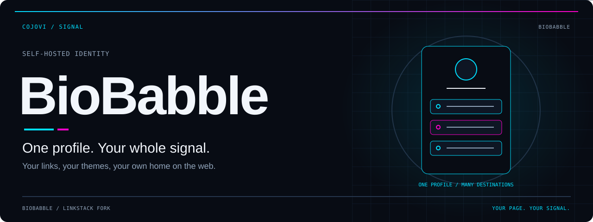
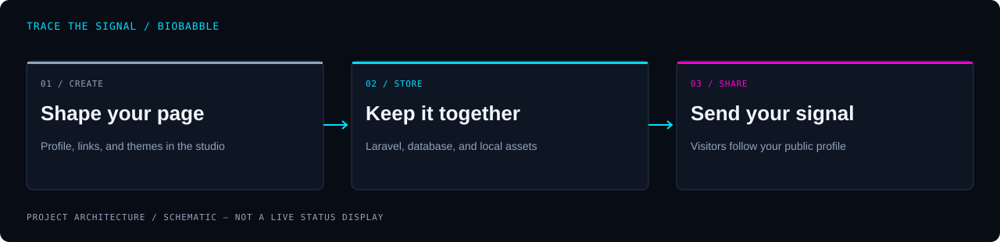

<!-- COJOVI / SIGNAL — BioBabble edition. Keep README.md and readme-assets/ together. -->
<!-- Modification notice: README presentation and documentation adapted for cojovi/BioBabble; application code and upstream notices unchanged by this documentation refresh. -->
<a name="top"></a>

<p align="center">
  
</p>

<h1 align="center">BioBabble</h1>

<p align="center">
  <strong>One profile. Your whole signal.</strong><br>
  Bring your links, identity, and themes together on a site you host.
</p>

<p align="center">
  
</p>

<p align="center">
  <a href="#overview">Overview</a> ·
  <a href="#architecture">Architecture</a> ·
  <a href="#quickstart">Quickstart</a> ·
  <a href="#configuration">Configuration</a> ·
  <a href="#usage">Usage</a> ·
  <a href="#validation">Validation</a>
</p>

---

<a name="overview"></a>
## `> meet_biobabble`

**BioBabble is Cody / cojovi’s fork of [LinkStack](https://github.com/LinkStackOrg/LinkStack)**, a self-hosted link-sharing platform. Create a public profile, arrange its links and page elements, and choose its appearance through a browser-based studio. Administrators manage the shared instance, users, and site settings.

A single address for the places people can find you—not another social network to maintain.

| Build your page | Make it yours | Host the community |
| :--- | :--- | :--- |
| Combine links, text, headings, email, telephone, video, spacers, and vCards. | Choose themes, edit buttons, and customize your profile. | Manage users, registration, site pages, configuration, and backups. |

> [!IMPORTANT]
> **BioBabble is the fork name; LinkStack remains the application.** The Composer identifier is `linkstackorg/linkstack`, the interface retains upstream names, and update settings still target LinkStack by default. This README does not claim a separately published BioBabble release or container image.

<a name="architecture"></a>
## `> trace_the_signal`

<p align="center">
  
</p>

```text
Author / administrator
        ↓ authenticated dashboard and studio
Laravel + Livewire
        ├─ users, links, buttons, and pages in the database
        ├─ Blade views, uploaded assets, and themes
        └─ environment and advanced configuration
        ↓ server-rendered public profile
Visitor → /@handle → chosen link destination
```

The public profile and administration interface belong to the same PHP application. SQLite and MySQL are the database choices exposed by the installer. Mail and social sign-in require separate configuration; they are not prerequisites for displaying a basic public profile.

**This is not a standard Laravel `public/` layout.** [bootstrap/app.php](bootstrap/app.php) binds the public path to the repository root, alongside [index.php](index.php), [assets/](assets/), and [themes/](themes/). Web-server access rules are part of the deployment boundary.

<a name="quickstart"></a>
## `> prepare_the_instance`

### 1. Choose the right starting point

For **this fork**, obtain the source:

```bash
git clone https://github.com/cojovi/BioBabble.git
cd BioBabble
```

For a packaged **upstream LinkStack** installation, use the [upstream releases](https://github.com/LinkStackOrg/LinkStack/releases). Those archives are not verified BioBabble builds. The upstream container project is [LinkStack Docker](https://github.com/LinkStackOrg/linkstack-docker), not a fork-specific image.

> [!WARNING]
> **A fresh source checkout is not a prepared installation archive.** It has no `vendor/autoload.php`; its tracked `database/database.sqlite` is empty; and the installer’s first page queries the `users` table. Dependencies and database initialization must be resolved before that page can run. No end-to-end fork installation command has been verified here.

### 2. Check requirements and packaging

- [composer.json](composer.json) declares PHP `>=8.0`; the locked Laravel framework requires `^8.0.2`. Check the full lockfile against your chosen PHP runtime rather than assuming every PHP 8 release works.
- The front controller checks `bcmath`, `ctype`, `curl`, `dom`, `fileinfo`, `json`, `mbstring`, `openssl`, `pcre`, `pdo`, `tokenizer`, `xml`, and `iconv` while `INSTALLING` exists. Your database also needs its matching PDO driver.
- Composer is needed for a source dependency build. Node/npm are used for the Laravel Mix asset pipeline, not to run the PHP web application.
- Review dependency scripts before installing: Composer hooks invoke Artisan, and the update hook contains a Windows-style `echo.>` command for `storage/app/ISINSTALLED`.
- The [release workflow](.github/workflows/release.yml) contains dependency, migration, and seeding steps, but clones and publishes **upstream LinkStack** explicitly. Do not treat it as a ready-to-run BioBabble release procedure.

The missing source-to-installation handoff needs a tested fork packaging procedure. Do not replace that work with a blind `composer update`, a production migration, or a claim that the wizard alone initializes a blank checkout.

### 3. Complete setup privately

Once you have a prepared installation with dependencies, a configured environment, and initialized database tables:

1. Configure a PHP-capable web server and its rewrite/access-denial rules.
2. Keep the installation reachable only by trusted operators during setup.
3. Open the instance root while the `INSTALLING` marker is present.
4. Follow the installer’s database selection, administrator creation, and site options.
5. Confirm setup completes and installer routes are no longer active before public exposure.

The wizard uses `INSTALLING` and `INSTALLERLOCK` to select its routes. `storage/app/ISINSTALLED` is a separate marker involved in key generation and advanced-config creation. Do not toggle these files casually on a live instance.

<a name="configuration"></a>
## `> shape_the_instance`

Configuration comes from Laravel’s environment settings and PHP files under [config/](config/). The administrator interface exposes configuration editors; access to them is privileged access to the application’s operation.

| Setting | Purpose / boundary |
| :--- | :--- |
| `APP_NAME`, `APP_URL` | Instance name and base URL. Use the deployed HTTPS URL in production. |
| `APP_ENV`, `APP_DEBUG` | Environment and error detail. Disable debug output on public deployments. |
| `APP_KEY` | Application encryption key; keep it private and stable for an existing installation. |
| `DB_CONNECTION`, `DB_DATABASE` | Select the database and its name/path. SQLite falls back to `database/database.sqlite`. |
| `DB_HOST`, `DB_PORT`, `DB_USERNAME`, `DB_PASSWORD` | Database connection settings for MySQL. |
| `ALLOW_REGISTRATION` | Controls the default registration route; review the custom-route exception below. |
| `REGISTER_AUTH` | Installer selects `auth` or `verified` for studio access. Verification requires working mail. |
| `HOME_URL` | Selects a profile as the instance homepage when configured. |
| `FORCE_ROUTE_HTTPS` | Forces HTTPS URL generation in specific route groups; it does not provision TLS. |
| `MAINTENANCE_MODE` | Changes route availability and displays the maintenance page. |
| `ALLOW_USER_EXPORT`, `ALLOW_USER_IMPORT` | Gates the corresponding data export/import routes. |

For mail, inspect [config/mail.php](config/mail.php). Social-provider settings live in [config/services.php](config/services.php); its GitHub redirect is still a placeholder, so provider presence is not proof of a working integration.

### Advanced configuration

The shareable template is [storage/templates/advanced-config.php](storage/templates/advanced-config.php). Application code copies it to `config/advanced-config.php` when the installation marker permits and no destination exists.

- `login_url`, `register_url`, and `forgot_password_url` change authentication paths.
- `custom_url_prefix` supplements `/@handle`; the supplied template uses `+`.
- `custom_home_url`, `home_theme`, metadata, share-button behavior, and custom buttons control presentation.
- The analytics field inserts supplied HTML into page heads. Review it as executable page content, not plain text.

> [!WARNING]
> In [routes/auth.php](routes/auth.php), a non-default `register_url` enables registration even when `ALLOW_REGISTRATION` is false. Check the effective route behavior before calling an instance private or registration-disabled.

<a name="usage"></a>
## `> publish_your_signal`

After setup, sign in at the configured login path—`/login` in the supplied template.

| Destination | What to do |
| :--- | :--- |
| `/dashboard` | Enter the authenticated dashboard. |
| `/studio/page` | Edit the public page and handle. |
| `/studio/links` | Manage existing links and their order. |
| `/studio/add-link` | Add a link or another supported page element. |
| `/studio/theme` | Choose the page’s theme. |
| `/studio/profile` | Manage account/profile settings. |
| `/@handle` | View the public page; replace `handle` with your actual page handle. |
| `/admin/users` | Admin-only user management. |
| `/admin/theme` | Admin theme management. |
| `/admin/config` | Admin configuration interface. |

These are application paths, not links to a hosted BioBabble service. Custom authentication paths and homepage settings can change your navigation.

### Themes and content

The checkout includes [PolySleek](themes/PolySleek/readme.md) and [galaxy](themes/galaxy/readme.md). Keep theme authors’ notices with their files. Treat uploaded theme packages as trusted code/assets; inspect them before installation.

Preview your profile while signed out. Check button destinations, readable contrast, small-screen layout, and any public contact information before sharing its URL.

### Updates and backups

[config/self-update.php](config/self-update.php) defaults to LinkStack’s HTTP update service; `JOIN_BETA` changes the upstream service. Review `SELF_UPDATER_SOURCE` and repository settings before using one-click updates on a fork. An upstream update can replace fork-specific code.

Keep independent backups of the database, uploads, themes, and private configuration. The inherited README specifically warns that MySQL data is not included in the updater backup; do not assume an application archive is a complete database backup. Test restoration before upgrading.

<a name="validation"></a>
## `> check_before_you_ship`

### Declared development commands

With dependencies installed in an isolated development copy, [package.json](package.json) provides:

```bash
npm run development   # Laravel Mix development asset compilation
npm run watch         # Rebuild assets on changes
npm run production    # Production asset compilation
```

`npm run dev` aliases `development`; it does **not** start a PHP web server. [webpack.mix.js](webpack.mix.js) compiles `resources/js/app.js` and `resources/css/app.css` into `js` and `css` output paths.

There is no npm test script. [phpunit.xml](phpunit.xml) references `tests/Unit` and `tests/Feature`, but neither directory is present in this checkout. Builds, installation, and application tests were **not run** for this documentation refresh; no passing CI or deployment status is implied.

### Deployment checklist

- [ ] Resolve dependency/platform requirements and document a reproducible fork build.
- [ ] Initialize a disposable database and complete the installer successfully.
- [ ] Verify login, page editing, ordering, theme selection, and signed-out viewing.
- [ ] Check registration behavior, roles, verification mail, and password reset as used.
- [ ] Confirm HTTPS, trusted proxy behavior, and production error settings.
- [ ] Confirm secrets, database files, backups, logs, and source internals cannot be downloaded.
- [ ] Back up data independently and verify a restore before using the updater.
- [ ] Retain upstream licensing and offer corresponding source where the license requires it.

<a name="security"></a>
## `> draw_the_boundary`

**The source checkout tracks `.env` despite listing it in `.gitignore`.** Its values were deliberately not inspected for this refresh. Treat that as a publication risk: review privately, rotate any exposed live credentials, and stop tracking operational secrets through a separate approved maintenance change. Ignoring a file does not remove it from Git history.

The root [.htaccess](.htaccess) denies dotfiles, SQLite files, and ZIP archives, but those rules depend on Apache configuration. Other servers need equivalent protections and additional review of exposed application directories. The supplied `server.php` serves existing files directly; PHP’s development server is not a production security boundary.

Protect administrator accounts, config editors, uploads, logs, and backups. Review analytics and social-provider data flows rather than assuming self-hosting eliminates all external requests. Use the inherited [security policy](SECURITY.md) for private vulnerability reporting.

<a name="license"></a>
## `> preserve_the_lineage`

**BioBabble derives from [LinkStackOrg/LinkStack](https://github.com/LinkStackOrg/LinkStack).** This refresh changes README presentation and documentation for the fork; it does not reassign authorship of the application.

The repository’s [LICENSE](LICENSE) is **GNU Affero General Public License v3.0**. Preserve copyright/license notices, identify modifications, and comply with corresponding-source obligations, including the applicable network-interaction requirements for modified versions. The Composer metadata says `GPL-3.0-or-later`, which conflicts with the shipped AGPL text; this documentation does not silently resolve or relicense that discrepancy.

### Upstream credits

- Foundation: [Laravel](https://github.com/laravel/laravel), [littlelink-admin](https://github.com/khzg/littlelink-admin), and [LittleLink](https://github.com/sethcottle/littlelink).
- Interface: [Hope UI Laravel Dashboard](https://github.com/iqonicdesignofficial/hope-ui-laravel-dashboard), [Animate.css](https://github.com/animate-css/animate.css), [CKEditor 4](https://github.com/ckeditor/ckeditor4), and [CKEditor 5](https://github.com/ckeditor/ckeditor5).
- Configuration and maintenance: [Laravel EnvEditor](https://github.com/GeoSot/Laravel-EnvEditor), [Laravel Self-Updater](https://github.com/codedge/laravel-selfupdater), and [Laravel Backup](https://github.com/spatie/laravel-backup).
- Contact and sharing: [vCard](https://github.com/jeroendesloovere/vcard) and [BaconQrCode](https://github.com/Bacon/BaconQrCode).

Thanks to LinkStack’s contributors, beta testers, and upstream supporters: Stephen Marshall, Jascha Urbach, LeoColman, Eric Chung, Daltz, Jan Klomp, AnhDOS, MrSpuddy, Chih Wang, kigordid, Ariq Naufal, Molleman-De-Coster-BV, RogueThorn, sachacalibre, and John Francis Sukamto. Preserve third-party notices when redistributing bundled components.

See [CONTRIBUTING.md](CONTRIBUTING.md) and [CODE_OF_CONDUCT.md](CODE_OF_CONDUCT.md) before contributing.

---

<p align="center">
  
</p>

<p align="center">
  <strong>One profile. Your whole signal.</strong><br>
  <sub>A <a href="https://github.com/cojovi">Cody / cojovi</a> fork · Built on LinkStack<br>
  Presented in COJOVI / SIGNAL. Upstream lineage intact.</sub>
</p>

<p align="center"><a href="#top">↑ Back to the signal</a></p>
